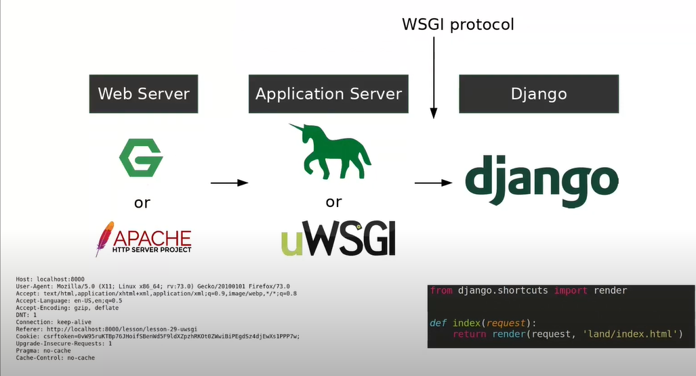
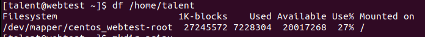
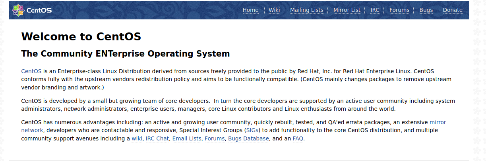
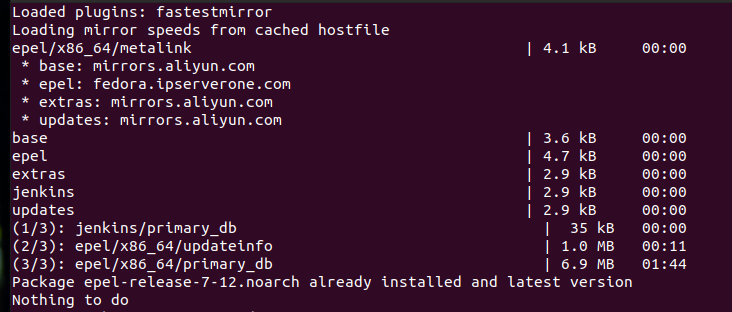
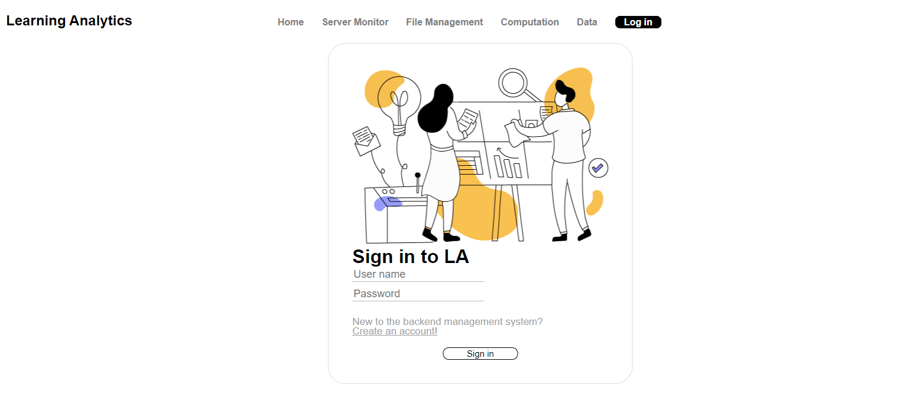

## 基于Nginx的Django + uwsgi前后端分离部署记录
### 相关介绍  
可参考该视频对本文档所安装的相关内容进行基本了解：https://www.youtube.com/watch?v=UklcIDgHtwQ    
  
以及前后端分离部署的参考记录：https://www.jianshu.com/p/a18aa307a95a  
当用户访问某网站时需要将请求发送给web server(本服务器采用即将被安装的Nginx)。而当网页逐渐变得复杂，用户的输入变得更加多样时，我们则需要在其子进程中内置一个脚本将用户的相关输入和请求转换为html语言以供用户的浏览器使用。python语言定义的相关脚本接口即为WSGI（Web Server Gateway Interface ）。本文安装的uWSGI可以实现同WSGI相同的功能，同时拥有更高的工作效率并且本身也可以作为服务器被用户访问。  
同时，由于我们需要实现的是前后端分离的架构，需要解决前后端的跨域问题，如何设置Nginx是最重要的问题。  
**本次部署将前端和后端分别部署在了10.21.44.36服务器的443和8080端口**  
服务器的系统为CentOS7.8（**Ubuntu上的nginx配置方法与CentOS略有不同，请有需要的同事自行查询学习**）， Linux内核版本3.10.0（x86_64）  
### 1. 安装Nginx并开放HTTP连接（利用EPEL拓展包）
https://qizhanming.com/blog/2018/08/06/how-to-install-nginx-on-centos-7（反向代理相关）
1.1 进入10.21.44.36服务器后首先使用df -h查看磁盘状态，如图所示，可用空间较多，可以进行后续安装。  
  
1.2 安装EPEL拓展包
> sudo yum install epel-release  

1.3 安装Nginx
> sudo yum install nginx
  
安装过程中出现了如下错误信息
>kernel: NMI watchdog: BUG: soft lockup -CPU#0 stuck for 39s!

当程序在loop中运行超过20秒后会出现上述信息。但是通常情况下，该信息不会导致宕机，如果程序正确则可以继续等待直至程序运行完成。（如有必要可以修改20秒这个等待时间）

该过程中下载并了nginx和相关包共49个，需要至少51MB的磁盘空间。

1.4 防火墙配置
由于centos的防火墙默认关闭http连接，此处需要将其开启
`sudo systemctl start firewalld`

首先使用如下指令进行防火墙状态检查：
> sudo firewall-cmd --list-service

若可以看到**dpcpv6-client http**则无需进行接下来的步骤。否则需要将http/https连接加入白名单中
>$ sudo firewall-cmd --zone=public --permanent --add-service=http       
$ sudo firewall-cmd --zone=public --permanent --add-service=https   
$ sudo firewall-cmd --reload  

1.5 启动Nginx服务
设置开机启动
> sudo systemctl enable nginx

启动Nginx
> sudo systemctl start nginx

之后从浏览器(需要接入学校局域网)输入10.21.44.36后可以进入如下基础界面：
  

### 2. 部署后端代码（安装并配置uWSGI）
2.1 安装python3 （如已安装可跳过该步骤）
更新yum (-y可以跳过yes/no确认)
> yum update -y

安装python3
> yum install -y python3

2.2 安装git（如已安装可跳过该步骤）
> sudo yum install git  
> git --version 
 
需要23MB的磁盘空间，如version有显示则安装成功。
2.3 下载Django后台代码  
可以配置gitlab的ssh key后直接在服务器上进行clone或是使用scp将相关代码上传到服务器上。此处不多赘述。  
源码地址http://10.20.217.17/Meiyan/background-management    
解压后，在上线前修改Django后台代码中`Background_Management`目录下 Setting.py中的 debug行以保护源码信息  
> DEBUG = False

2.4 虚拟环境配置和部署准备
此处使用virtualenv进行虚拟环境设置
> sudo pip3 install virtualenv -i https://pypi.tuna.tsinghua.edu.cn/simple

进入虚拟环境
> virtualenv venvDjango  
> cd venvDjango/  
> source ./bin/activate

假设我们目前所在的工作目录是`back_final/background-management-test`  
首先安装部分库所需的c语言编译工具及所需的python相关头文件（如Python.h）
> yum install -y pcre pcre-devel pcre-static  
> yum group install "Development Tools"
> yum -y install python36-devel  
  


最后通过项目中requirements目录所提供的`common.txt`安装所需库及uwsgi，(不同的环境可能会出现不同的安装错误，届时请自行查询解决方法。)
> pip install --no-cache-dir -i https://pypi.tuna.tsinghua.edu.cn/simple -r requirements/common.txt --defualt-timeout=100  (最后的指令是为了防止因网速过慢而出现的read time报错)


2.5 配置uWSGI
进入后端代码目录后创建uwsgi.ini文件并输入如下内容：
~~~
[uwsgi]
socket=10.21.44.36:8001  
http = 10.21.44.36:8080  #可以直接访问的地址
chdir = /home/talent/back_final/background-management-test/ #目录位置
py-autoreload=1
wsgi-file = /home/talent/back_final/background-management-test/Background_Management/wsgi.py
master = true
pidfile = uwsgi.pid
enable-threads = true
thunder-lock = true
home = /home/talent/venvDjango #虚拟环境位置
daemonize = uwsgi.log #日志文档位置，一旦声明uwsgi启动后会作为守护进程在后台运行。
uid = talent (根据服务器上的实际用户名和组名进行调整)
gid = talent (根据服务器上的实际用户名和组名进行调整)
~~~

**在实际的ini文件中不要编写注释，否则会出现路径解析错误！**

2.6 环境测试 **（请提前连接OpenVPN，相关设置在文末）**
>python manage.py runserver  

若可以正常运行，则进入接下来的步骤。

2.7 尝试启动uWSGI
设置防火墙，开启8080端口的外部访问（之前仅设置了http(80) 和https(443)端口）：
> firewall-cmd --zone=public --add-port=8080/tcp --permanent

通过下面的指令启动uwsgi
> 启动：uwsgi --ini uwsgi.ini  
停止：uwsgi --stop uwsgi.pid  
重启：uwsgi --reload uwsgi.pid

启动成功后在`uwsgi.log`中会出现如图所示的信息：  
  
此时可以通过 http://10.21.44.36:8080/django_api/admin_menu 测试Django部署情况，出现如下界面则成功：    
  

2.8 uWSGI的开机启动设置  
此处我们需要通过添加服务的方式来设置CentOS的开机启动。
进入`/etc/systemd/system`目录，创建uwsgi.service文件。  
将如下内容编写进文件中,**请核对该文件下的各文件位置并作出相应修改**：
```
[Unit]
Description=uWSGI instance to serve Django
After=openvpn-client@webtest-client.service #在openvpn启动后再启动uwsgi服务
[Service]
WorkingDirectory=/home/talent/back_final/background-management-test/Background_Management/ # 工作目录，请务必设置好，否则uwsgi会检查不到我们的Django项目
ExecStart=/usr/bin/bash -c 'source /home/talent/venvDjango/bin/activate; cd /home/talent/back_final/background-management-test/; uwsgi --ini uwsgi.ini' #打开虚拟环境 + 启动uwsgi
ExecStop=/usr/bin/bash -c ' var=$(cat /home/talent/back_final/background-management-test/uwsgi.pid); kill -9 $var' #根据uwsgi的进程号关闭uwsgi进程
StandardError=syslog
RemainAfterExit=yes #该行设置将允许uwsgi服务持续进行直到用户手动停止。

[Install]
WantedBy=multi-user.target
```
之后即可启动服务并设置开机启动
> systemctl start uwsgi  
> systemctl enable uwsgi  

  
### 3. 部署前端代码以及Nginx配置
3.1 安装Node.js: Node.js允许服务器运行Javascript脚本。  
首先使用curl指令增加yum仓库，然后从新仓库下载并安装Node.js和npm (占用61MB的磁盘空间,因为是国外源下载会比较缓慢)
> curl -sL https://rpm.nodesource.com/setup_10.x | sudo bash -  
> sudo yum install -y nodejs

确认安装成功：
> npm --version  
> node --version

3.2  打包前端脚本用于生产环境
首先进行相关环境的配置，npm install需要较长时间，此处可以考虑使用国内源进行环境安装：
> cd /home/talent/front_final/background-management-front-end-test/ 
> npm install express --registry=https://registry.npm.taobao.org  
  
之后即可进行编译（打包）
> npm run build  

在安装成功后会生成一个dist目录，接下来配置Nginx，以运行打包后的前端文件。  
3.3 Nginx相关配置
修改nginx.conf文件，已部署前端代码
> sudo vi /etc/nginx/nginx.conf

在Server模块中的location /块中添加如下内容,并修改Server块的基本信息（此处的conf不是最终版本，仅做示例用，也可以先不修改）：
~~~
    server {
        listen       80 default_server; #将代码部署到80端口
        listen       [::]:80 default_server;
        server_name  lamanagement; #服务器名，可随意定义

    location / {
                root /home/talent/front_final/background-management-front-end-test/dist; #该地址为打包后的前端代码地址，请根据情况自行修改
                index index.html;
        }
~~~
上述配置文件将会将http://10.21.44.36:80/ 的url自动跳转到前端代码上，输入http://10.21.44.36 若能够看到前端界面则部署成功。  
   
注意此处我们仍然在使用http协议，https协议和相关证书配置在下文介绍。
配置完成后重新启动nginx会遇到403错误。原因是SELinux阻止了外部的访问。
进行如下操作将Nginx加入白名单
> sudo setenforce 1  
> semanage permissive -a httpd_t

3.4 SSL证书和HTTPS相关设置：  
此处我们使用自签名证书：  
在使用MacOS Catalina 10.15和ios 13 之后的苹果操作系统时，可能会出现自签名证书无法通过验证问题：
错误代码及说明如下：
```
NET::ERR_CERT_INVALID

host.domain normally uses encryption to protect your information. When Google Chrome tried to connect to host.domain this time, the website sent back unusual and incorrect credentials. This may happen when an attacker is trying to pretend to be host.domain, or a Wi-Fi sign-in screen has interrupted the connection. Your information is still secure because Google Chrome stopped the connection before any data was exchanged.

You cannot visit host.domain right now because the website sent scrambled credentials that Google Chrome cannot process. Network errors and attacks are usually temporary, so this page will probably work later.
```
这个问题的原因并非是日志中所说的加密方式混乱，而是在生成ssl证书时缺少了两个属性：  
<code>Subject Alternative Name (=DNS:\<CN\>)</code>以及<code>Extended Key Usage (=id-kp-serverAuth)</code>  
该问题的详细介绍可参考该网站：https://eengstrom.github.io/musings/self-signed-tls-certs-v.-chrome-on-macos-catalina   

接下来开始生成证书:  
首先确认openssl的配置文件位置，之后会用到。10.21.44.36的openssl文件位置在<code>/etc/pki/tls/openssl.cnf</code>   
之后创建相关文件：  
> touch /etc/pki/CA/index.txt  生成证书索引数据库文件    
echo 01 > /etc/pki/CA/serial   指定第一个颁发证书的序列号


然后创建并进入证书文件夹
> mkdir /etc/nginx/ssl/manage  

随后我们开始生成证书：  
首先创建CA 密钥:
> openssl genrsa -des3 -out ca.key 2048
密钥密 码设置为:ladaydayup

创建CA根证书：
> openssl req -sha256 -new -x509 -days 3650 -key ca.key -out ca.crt

之后得到的反馈和设置如下：
```
(base) [root@webtest test]# openssl req -sha256 -new -x509 -days 3650 -key ca.key -out ca.crt

Enter pass phrase for ca.key:
You are about to be asked to enter information that will be incorporated
into your certificate request.
What you are about to enter is what is called a Distinguished Name or a DN.
There are quite a few fields but you can leave some blank
For some fields there will be a default value,
If you enter '.', the field will be left blank.
-----
Country Name (2 letter code) [AU]:CN
State or Province Name (full name) [Some-State]:Guangdong
Locality Name (eg, city) []:Shenzhen
Organization Name (eg, company) [Internet Widgits Pty Ltd]:SRIBD
Organizational Unit Name (eg, section) []:LA
Common Name (e.g. server FQDN or YOUR name) []:back_manage
Email Address []:nancygong@cuhk.edu.cn
```

生成服务器密钥：
> openssl genrsa -des3 -out server.key 2048    密码设置为ladaydayup

随后创建证书申请文件(.csr)**请确认config行 cat /etc/pki/tls/openssl.cnf 
的内容为服务器上的openssl配置文件的位置， subjectAltName可根据需要自行进行设置**:
```
openssl req -new \
    -sha256 \
    -key server.key \
    -reqexts SAN \
    -config <(cat /etc/pki/tls/openssl.cnf \ 
        <(printf "[SAN]\nsubjectAltName=DNS:10.21.44.36\nextendedKeyUsage=serverAuth")) \
    -out server.csr
```

相关输出结果和设置如下：
```
Enter pass phrase for server.key:
You are about to be asked to enter information that will be incorporated
into your certificate request.
What you are about to enter is what is called a Distinguished Name or a DN.
There are quite a few fields but you can leave some blank
For some fields there will be a default value,
If you enter '.', the field will be left blank.
-----
Country Name (2 letter code) [AU]:CN
State or Province Name (full name) [Some-State]:Guangdong
Locality Name (eg, city) []:Shenzhen
Organization Name (eg, company) [Internet Widgits Pty Ltd]:SRIBD
Organizational Unit Name (eg, section) []:LA
Common Name (e.g. server FQDN or YOUR name) []:10.21.44.36
Email Address []:nancygong@cuhk.edu.cn

Please enter the following 'extra' attributes
to be sent with your certificate request
A challenge password []: ladaydayup2020
An optional company name []:SRIBD
```
设置ssl密钥使我们在设置nginx时不再需要再输入密钥信息：
>cp -v server.{key,original}  
> openssl rsa -in server.original -out server.key  
> rm -v server.original

最后，生成证书（此处设置有效期为10年）**同样的，请确认config行 cat /etc/pki/tls/openssl.cnf 
的内容为服务器上的openssl配置文件的位置， subjectAltName可根据需要自行进行设置**:

```
openssl ca -in server.csr \
        -md sha256 \
        -keyfile ca.key \
        -days 3650 \
    -cert ca.crt \
    -extensions SAN \
    -config <(cat /etc/pki/tls/openssl.cnf \
        <(printf "[SAN]\nsubjectAltName=DNS:10.21.44.36\nextendedKeyUsage=serverAuth")) \
    -out server.crt
```

修改nginx.conf，最终的nginx.conf内容在下一部分设置反向代理后写出。


### 4. 通过反向代理部署后端代码
在第二步和第三步中我们已经分别部署了前端和后端的代码，只是前端在Nginx上，而后端在uWSGI上。在这一步中将会通过Nginx的反向代理功能实现前后端的连接：
在修改nginx.conf之前，先将Django的静态文件提取至一个目录下，以方便之后的静态文件定位。首先修改Django的settings.py设置静态文件的收集目录，此处可以输入任意目录，设置方法可参考 https://code.ziqiangxuetang.com/django/django-static-files.html 之后回到根目录输入
> python manage.py collectstatic

可发现项目中的所有静态文件都会被复制到settings.py中设置的 **STATIC_ROOT**目录下，我将静态文件全部放到了该目录，稍后的nginx.conf的设置会用到：
> /home/talent/background_management/Background_Management/static/

10.21.44.36的443端口相关配置如下**请注意修改前后端代码地址及ip地址。我已在配置文件中已进行了标注，请按实际情况进行修改！**：
~~~
user django; #与前后端的用户和用户组相同或是设置好前端代码的访问权限，否则会出现500错误
worker_processes auto;
pid /run/nginx.pid;


# Load dynamic modules. See /usr/share/doc/nginx/README.dynamic.
include /usr/share/nginx/modules/*.conf;

events {
    worker_connections 1024;
}

http {
    log_format main '$remote_addr - $remote_user [$time_local] "$request"'
                    '$status$body_bytes_sent" $http_referer"'
                    '"$http_user_agent" "$http_x_forwarded_for"';
    access_log  /etc/nginx/access.log  main;
    error_log /etc/nginx/error.log debug;

    sendfile            on;
    tcp_nopush          on;
    tcp_nodelay         on;
    keepalive_timeout   65;
    types_hash_max_size 2048;

    include             /etc/nginx/mime.types;
    default_type        application/octet-stream;

    # Load modular configuration files from the /etc/nginx/conf.d directory.
    # See http://nginx.org/en/docs/ngx_core_module.html#include
    # for more information.
    include /etc/nginx/conf.d/*.conf;
    include /etc/nginx/sites-enabled/*;
    ssl_session_timeout 10m;
    ssl_session_cache shared:SSL:10m;
    #此段内容启动80端口用于将把进入http网站的用户引导至https协议网站下
    server {
        listen          80;
        #服务器ip地址（域名），请自行修改
        server_name     10.21.44.36;
        rewrite ^/(.*)  https://10.21.44.36/$1 permanent;
    }


    server {
        listen       443 ssl;
        server_name  10.21.44.36;   #服务器ip地址（域名），请自行修改
        ssl_certificate /etc/nginx/ssl/manage/test/server.crt; #证书地址
        ssl_certificate_key /etc/nginx/ssl/manage/test/server.key; #证书密钥
        ssl_protocols TLSv1 TLSv1.1 TLSv1.2; #证书协议
        ssl_ciphers HIGH:!aNULL:!MD5; #支持的解密算法
        ssl_prefer_server_ciphers on;

        location / {
                add_header Access_Control-Allow-Origin *;
                add_header Access-Control-Allow-Methods 'GET, POST, OPTIONS, PUT';
                add_header Access-Control-Allow-Headers 'DNT, X-Mx-ReqToken, Keep-Alive, User-Agent, X-Requested-With, If-Modified-Since, Cache-Control, Content-Type, Authorization';
                root /home/talent/front_final/background-management-front-end-test/dist; #打包后的前端代码位置，请自行修改
                index index.html index.htm;
                try_files $uri $uri/ /index.html; #该行用于解决刷新页面等操作后无法找到界面的问题
        }

        error_page 404 /404.html;
        location = /404.html {

        }

        error_page 500 502 503 504 /50x.html;

        location = /50x.html {
        }
        # 反向代理的设置
        location /django_api {
                proxy_pass http://10.21.44.36:8080/django_api; #这里的地址与uWSGI的uwsgi.ini文件中http一行设置的地址应保持一致
                proxy_set_header   Host   $host;
                proxy_set_header X-Real-IP  $remote_addr;
                proxy_set_header X-Forwarded-For  $proxy_add_x_forwarded_for;
                proxy_set_header X-Forwarded-Proto https;
        }
      }
}  

~~~
重新启动Nginx
> sudo systemctl restart nginx
  
其中location = /404.html中可以定义我们自己的404/50x网页（此处没有设置），Nginx如果遇到了404/50x错误则会跳转到该网页。而django_api则是设置了反向代理，当我们访问这个地址时，nginx会将请求自动转发到对应的后台uwsgi服务器上。

### 5. 处理跨域问题并检查前后端连接是否正常
跨域问题：使用一个域名时想要访问其它域名就会触发跨域问题。在前端中我们使用localhost:80访问localhost:8000的后端api导致了跨域问题（CORS）。

可以通过反向代理进行解决。这段设置就是反向代理的设置。通过nginx的反向代理实现跨域，而不需要额外设置跨域权限。
~~~
        location /django_api {
                proxy_pass http://10.21.44.36:8080/django_api;
                proxy_set_header   Host   $host;
                proxy_set_header X-Real-IP  $remote_addr;
                proxy_set_header X-Forwarded-For  $proxy_add_x_forwarded_for;
                proxy_set_header X-Forwarded-Proto https;
        }
~~~


### 6. 其它问题
如果出现了问题请先查看<code>/var/log/nginx</code>目录下的error.log。下面的信息是部署过程中可能遭遇的问题  
**6.1 端口冲突问题**
> conflicting server name "localhost" on 0.0.0.0:80, ignored

该问题会导致寻址失败，即使其它地方正确配置仍然会出现404错误，因此需要加以重视。
出现该问题有两种原因：  
(1) 在nginx.conf文件中对同一个监听端口定义了多个相同的server_name，请重新调整server_name。   
(2) 在<code>/etc/nginx</code>目录下出现了多个类似的.conf文件，如果出现该情况请手动调整文件名或是进行删除操作，确保相关设置文件只剩下nginx.conf。

**6.2 刷新后505/404错误**
此处刷新<code>http://10.21.44.36/homepage/home</code>界面后出现了505错误。查看错误日志可见如下问题：
> rewrite or internal redirection cycle while internally redirecting to "/index.html/homepage/home", client: 10.30.96.144, server: localhost, request: "GET /homepage/home HTTP/1.1", host: "10.21.44.36"

解决办法：在全匹配规则下增加<code>try_files</code>指令，用于处理uri。其首要作用是检查文件是否存在，如果存在，则使用该文件响应请求。如果所有的文件或文件夹都找不到，则**重定向**到最后一个参数。  
例如在该设置下
> listen 80;  
> server_name example.com;  
> location / {  
> try_files $uri $uri/ /index.html  # $uri/检查文件夹存在性， $uri检查文件存在性  
> index index.html index.htm  
> }

当用户输入 example.com/homepage 时，根据try_files规则会查看根部录下是否存在homepage这个文件，然后再找有没有homepage这个目录。如果也没有则重定向到 example.com/index.html

**6.3 OpenVPN配置**
安装OpenVPN,首先安装扩展仓库和工具，之后安装OpenVPN
> yum install epel-release
> yum install net-tools
> yum install openvpn


将vpn相关文件拷贝至<code>/etc/openvpn/client</code>目录下。在该目录复制一个conf文件：
> cp webtest-client.ovpn webtest-client.conf

设置开机启动，并开启openvpn
> systemctl start openvpn-client@webtest-client  
> systemctl enable openvpn-client@webtest-client

若要关闭服务并停止开机启动则使用:
> systemctl stop openvpn-client@webtest-client
> systemctl disable openvpn-client@webtest-client


**6.4 Django环境测试中可能遇到的问题：**
在运行<code>python manage.py runserver</code>时如果遇到了sqlite版本不符的情况，请参考如下解决方法：  
下载最新的sqlite
> wget -O sqlite-autoconf-3330000.tar.gz https://www.sqlite.org/2020/sqlite-autoconf-3330000.tar.gz

解压并编译：
> tar zxvf sqlite-autoconf-3330000.tar.gz  
cd sqlite-autoconf-3330000  
./configure  
sudo make  
sudo make install  

覆盖旧版本
>sudo cp sqlite3 /usr/bin/sqlite3  
>sudo cp libsqlite3.so.0.8.6 /usr/lib64/libsqlite3.so.0.8.6  
>sudo cp libsqlite3.so.0 /usr/lib64/libsqlite3.so.0
    
    
**6.5 部署后可能出现的错误：**

*  404错误: 该错误是前端所设置的url无法被正确导向至后端,出现该问题时请检查如下三个地方：前端api的url, 后端的urls.py,以及nginx.conf中的反向代理设置是否正确。
*  502错误：该错误为网关错误，其直接原因是连接超时。出现该情况的原因是后端uwsgi服务器的问题。可以通过back_final目录下的uwsgi.log进行问题排查。
*  500错误：可能有多种原因。目前所遇到的500错误是因为无法连接至数据库所致，出现问题时请检查后端服务器的启动情况，以及后端服务器是否连接至openvpn上，否则将无法访问后台数据库。


**6.6 Django后台管理系统相关功能(摘自 http://10.20.217.17/-/ide/project/Meiyan/background-management/edit/test/-/README.md)：**

**增加crontab 任务**  
每个crontab定时任务代表运行一个python程序  
```
python3 manage.py crontab add
  adding cronjob: (15ddc832ee51ece1e38f472205c79f23) -> ('*/10 * * * *', 'compute.stu_dis_half_hour5.task', '>>/home/zhewen/LA/DJA_COMPUTE/compute/output_log/stu_dis_half_hour5.log')
  adding cronjob: (548d9415a2ffc3178d54fc2618533d8e) -> ('*/10 * * * *', 'compute.gpa_loc.task', '>>/home/zhewen/LA/DJA_COMPUTE/compute/output_log/gpa_loc.log')
  adding cronjob: (3581a0bfeddb8354418787ce583f64be) -> ('*/10 * * * *', 'compute.json_merge.task', '>>/home/zhewen/LA/DJA_COMPUTE/compute/output_log/json_merge.log')
  adding cronjob: (df32c52eadd889f03a100d98359e5639) -> ('*/10 * * * *', 'compute.Absence.task', '>>/home/zhewen/LA/DJA_COMPUTE/compute/output_log/record_Absence.log')
  adding cronjob: (17a18fe2a8d60785bd96a9be30492903) -> ('*/10 * * * *', 'compute.clear_stu_pop.task', '>>/home/zhewen/LA/DJA_COMPUTE/compute/output_log/clear_stu_pop.log')
  adding cronjob: (68bb2737614fb9901db10e289f97aada) -> ('*/10 * * * *', 'compute.student_population_daily.task', '>>/home/zhewen/LA/DJA_COMPUTE/compute/output_log/student_population_daily.log')
  adding cronjob: (a8c177cf5c5c099636643e519c3f7846) -> ('*/5 * * * *', 'compute.real_time_attendance_rate.task', '>>/home/zhewen/LA/DJA_COMPUTE/compute/output_log/realtime.log')
```
**移除crontab 任务(这个需要时才操作)**  
```
python3 manage.py crontab remove  
  removing cronjob: (15ddc832ee51ece1e38f472205c79f23) -> ('*/10 * * * *', 'compute.stu_dis_half_hour5.task', '>>/home/zhewen/LA/DJA_COMPUTE/compute/output_log/stu_dis_half_hour5.log')
  removing cronjob: (548d9415a2ffc3178d54fc2618533d8e) -> ('*/10 * * * *', 'compute.gpa_loc.task', '>>/home/zhewen/LA/DJA_COMPUTE/compute/output_log/gpa_loc.log')
  removing cronjob: (3581a0bfeddb8354418787ce583f64be) -> ('*/10 * * * *', 'compute.json_merge.task', '>>/home/zhewen/LA/DJA_COMPUTE/compute/output_log/json_merge.log')
  removing cronjob: (df32c52eadd889f03a100d98359e5639) -> ('*/10 * * * *', 'compute.Absence.task', '>>/home/zhewen/LA/DJA_COMPUTE/compute/output_log/record_Absence.log')
  removing cronjob: (17a18fe2a8d60785bd96a9be30492903) -> ('*/10 * * * *', 'compute.clear_stu_pop.task', '>>/home/zhewen/LA/DJA_COMPUTE/compute/output_log/clear_stu_pop.log')
  removing cronjob: (68bb2737614fb9901db10e289f97aada) -> ('*/10 * * * *', 'compute.student_population_daily.task', '>>/home/zhewen/LA/DJA_COMPUTE/compute/output_log/student_population_daily.log')
  removing cronjob: (a8c177cf5c5c099636643e519c3f7846) -> ('*/5 * * * *', 'compute.real_time_attendance_rate.task', '>>/home/zhewen/LA/DJA_COMPUTE/compute/output_log/realtime.log')
```
运行项目  
重新加载uwsgi即可：
> uwsgi --reload uwsgi.pid  


**App介绍：**  

**auto_inspection**    
应用简介：  
- 该应用针对 http://10.20.217.17/Chicheng/la-client-app 中的所有接口进行访问并收取status_code和访问时间。
- 所有接口访问结束为一个循环，通过设定循环次数进行多次测试，所有信息以pandas库中的DataFrame收集,
- 经过处理寻找出其中无法连接的接口和连接用时最长的接口，汇总为content并发送给指定邮箱。
- 可以对heapmap中使用的两个接口数据检查，各个分支是否为空，人数统计是否为负值。结果会直接发给对应的邮箱-可能发给163或者qq是最好的，学校邮箱有的时候会有限制发不出去。
- 检查每个接口里的分支是否具备不为空，数字不为负值，比例数值在0-1的区间范围内
- 结果会直接发给对应的邮箱-可能发给163或者qq是最好的，学校邮箱有的时候会有限制发不出去。
- 结果中如果接口没有问题，邮件中就会显示为一个基本为空的dict

输出：  
- 在测试完成后，网页会显示结果，如果成功，则显示 “inspection success”,失败则显示“inspection failed”
- 此外，自动化收集的接口信息会导出成csv文件保存在auto/results中，
- 测试文件会选择所有接口中的无法访问接口和连接时间最长的接口并发送邮件给指定的邮箱
- 在终端中会显示循环访问接口次数

auto_inspection.views中的函数解释：  
    1. mail(content,receiver_name,receiver_mail)，该函数输入content-邮件内容；receiver_name-接收人名称；     reveiver_mail-接收人邮箱，并发出邮件
    2. check_200_in_status(X)：检查接口是否能够正常访问
    3. auto_port(port,iterations),输入接口和循环次数，对这个接口多次访问并汇总数据表输出
    4. inspect(iterations)，输入循环次数，对所有接口做auto_port汇总，经过pandas语句处理最后集合成完整的
    数据表信息，保存csv，发送邮件

可以更改的地方：  
- 对接口的访问循环次数：在auto_inspection.views中可以更改iterations次数
- 发送邮件：在auto_inspection.views中可以更改my_sender,my_pass信息以修改发出邮箱
- 接受邮箱：在auto_inspection.views中可以更改inspect函数中的mail内的邮箱以修改接受邮箱信息
- csv保存路径：在auto_inspection.views中可以更改inspect函数中的path以修改接受邮箱信息

**compute**    
应用简介：  
- 包含计算模块的相关内容内容
- 所谓的计算模块就是指：LA网站项目对应的后端python文件
- 这些python文件的主要作用是：
- 1、从db中提取相应的数据；
- 2、将相应的数据计算出来，供网站前端调用。
- 同时该模块为LA网站的后端管理系统提供接口服务。


